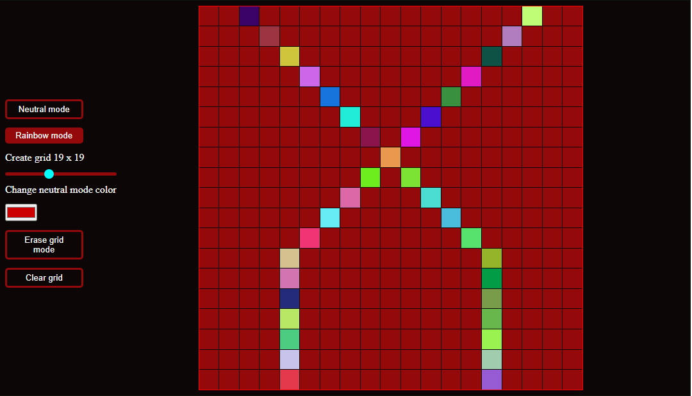

# Overview of Project

This project is about making a retro sketch by:

- creating your grid size using the slide.
- selecting your choice of color by indicating between **neutral** , **rainbow** and **erase** mode .
- changing neutral mode color by choosing from the color picker.
- clearing all grid by clicking on the **clear grid** button.

## What I learnt

Using Javascript _this_ in a function event handler returns the global window object. It was a block that took me using the _console_ to figure out.

Preview site: [Retro-sketch site](https://retro-sketch.netlify.app/)
